# 🤖 Ultra Low Latency Voice AI Agent with Multi-Tool Support: Samantha

An intelligent AI assistant built with **FastRTC**, **Streamlit**, **LangGraph**, and **Cerebras**. Samantha provides both an **ultra-low latency voice interface** and a **clean text-based chat interface** with advanced capabilities including web search, RAG-based document queries, flight & hotel booking, stock market analysis, and weather updates.

## ✨ Key Features

- **💬 Clean Chat Interface**: Streamlit-based UI for seamless text conversations
- **🧠 Intelligent Agent**: Built with LangGraph and Cerebras (GPT-OSS-120B) for context-aware responses
- **📚 RAG System**: ChromaDB-powered document knowledge base with PDF ingestion
- **🛠️ Rich Toolset**: 7 specialized tools for diverse tasks
- **📄 Document Upload**: Easy PDF ingestion through web interface
- **🎨 Modern UI**: Beautiful, responsive design with emoji-enhanced interactions

## 🏗️ Architecture

```mermaid
graph TB
    subgraph "User Interfaces"
        A[🌐 Streamlit UI] --> B[💬 Chat Interface]
        A --> C[📚 Document Upload]
        D[🎙️ Gradio UI] --> E[⚡ FastRTC Engine]
    end

    subgraph "Core Logic"
        B --> F[🧠 LangGraph Agent]
        E --> G[🎤 SpeechRecognition STT]
        G --> F
        F --> H[🤖 Cerebras LLM]
        F --> I[🔊 Cartesia TTS]
        I --> E
    end

    subgraph "Data & Tools"
        C --> J[📄 PDF Processing]
        J --> K[📊 ChromaDB]
        F --> L[🛠️ Tools Layer]
        
        L --> M[🔍 Tavily Search]
        L --> K
        L --> N[✈️ Flight/Hotel]
        L --> O[📈 Stocks]
        L --> P[🌦️ Weather]
    end
```



### 🔄 Data Flow

```
Text Flow:  Streamlit Input → LangGraph Agent → Tools → Text Response
Voice Flow: FastRTC Audio → STT → LangGraph Agent → Tools → TTS → FastRTC Audio
```

## 🛠️ Tools & Capabilities

| Tool | Description | Provider |
|------|-------------|----------|
| 🔍 **Web Search** | Real-time web information retrieval | Tavily API |
| 📚 **Database Search** | Query uploaded PDF documents (RAG) | ChromaDB + HuggingFace |
| ✈️ **Flight Search** | Find flight options with pricing | Firecrawl + Kayak |
| 🏨 **Hotel Search** | Search hotels and accommodations | Firecrawl + Kayak |
| 📈 **Stock Price** | Real-time stock prices | YFinance |
| 🏢 **Company Info** | Company details and market cap | YFinance |
| 🌦️ **Weather** | Current weather conditions | OpenWeatherMap |

## 🚀 Tech Stack

| Component | Technology |
|-----------|-----------|
| **UI Frameworks** | [Streamlit](https://streamlit.io/) (Chat) & [Gradio](https://gradio.app/) (Voice) |
| **Voice Streaming** | [FastRTC](https://github.com/fastrtc/fastrtc) |
| **LLM** | [Cerebras](https://cerebras.net/) (gpt-oss-120b) |
| **Agent** | [LangGraph](https://langchain-ai.github.io/langgraph/) with InMemorySaver |
| **STT** | SpeechRecognition (Google) |
| **TTS** | [Cartesia](https://cartesia.ai/) Sonic 3 |
| **Vector DB** | ChromaDB |
| **Embeddings** | HuggingFace (sentence-transformers/all-MiniLM-L6-v2) |
| **RAG LLM** | Groq (llama-3.3-70b-versatile) |
| **PDF Processing** | PyPDF, RecursiveCharacterTextSplitter |

## 📋 Prerequisites

- **Python**: 3.10 or higher
- **API Keys** (required):
  - [Cerebras](https://cerebras.net/) - Main LLM
  - [Cartesia](https://cartesia.ai/) - Ultra-fast TTS
  - [Groq](https://groq.com/) - RAG LLM
  - [Tavily](https://tavily.com/) - Web search
  - [Firecrawl](https://firecrawl.dev/) - Travel scraping
  - [Serper](https://serper.dev/) - Shopping search
  - [OpenWeatherMap](https://openweathermap.org/) - Weather
  - [HuggingFace](https://huggingface.co/) - Embeddings (optional token)
- **Optional**:
  - [LangSmith](https://smith.langchain.com/) - Agent tracing and monitoring

## 📦 Installation

### 1. Clone the Repository
```bash
git clone https://github.com/Bharath8080/FastRTC_ReAct_Agent.git
cd FastRTC_ReAct_Agent
```

### 2. Create Virtual Environment
```bash
python -m venv .venv

# Windows
.venv\Scripts\activate

# macOS/Linux
source .venv/bin/activate
```

### 3. Install Dependencies
```bash
pip install -r requirements.txt
```

## ⚙️ Configuration

Create a `.env` file in the root directory:

```ini
# Core LLM
CEREBRAS_API_KEY=your_cerebras_key
GROQ_API_KEY=your_groq_key

# Voice Services
CARTESIA_API_KEY=your_cartesia_key

# Search & Tools
TAVILY_API_KEY=your_tavily_key
FIRECRAWL_API_KEY=your_firecrawl_key
SERPER_API_KEY=your_serper_key
OPENWEATHERMAP_API_KEY=your_openweathermap_key

# Optional - Embeddings
HF_TOKEN=your_huggingface_token

# Optional - LangSmith Tracing
LANGSMITH_TRACING=true
LANGSMITH_ENDPOINT=https://api.smith.langchain.com
LANGSMITH_API_KEY=your_langsmith_key
LANGSMITH_PROJECT=FastRTC_Agent
```

## 🚀 Usage

### 🎙️ Running Voice Agent (Ultra-Low Latency)

For real-time Speech-to-Speech (STS) interaction with ultra-low latency:

```bash
python app.py
```

The Gradio UI will launch at `http://localhost:7860`. This interface uses **FastRTC** for streaming audio and **Cartesia Sonic 3** for high-quality, low-latency speech generation.

### 💬 Running Text Chat & RAG

For text-based interaction and document management:

```bash
streamlit run main.py
```

The app will launch at `http://localhost:8501`

### 💬 Using the Chat Interface

1. **Open the Chat tab** (default)
2. **Type your question** in the input field
3. **Click Send** or press Enter
4. **View responses** in the chat history

### 📚 Adding Documents to RAG System

To enable Samantha to answer questions about your documents:

1. **Switch to the "Upload Documents" tab**
2. **Upload PDFs** using the file uploader
3. **Click "🚀 Ingest Documents"** to process and store in ChromaDB
4. **Return to Chat tab** and ask questions about your documents

**Example queries**:
- "What does the manual say about installation?"
- "Search the database for pricing information"
- "What's in the uploaded document about security?"

## 📂 Project Structure

```
FastRTC_ReAct_Agent/
├── main.py                     # Streamlit UI application
├── app.py                      # Alternative Gradio interface
├── ingest.py                   # Standalone PDF ingestion tool
├── requirements.txt            # Python dependencies
├── .env                        # Environment variables (create this)
│
├── scripts/
│   └── agent.py                # LangGraph agent configuration
│
├── tools/                      # Tool implementations
│   ├── __init__.py
│   ├── tavily_tool.py          # Web search
│   ├── database_tool.py        # RAG document search
│   ├── flight_tool.py          # Flight search
│   ├── hotel_tool.py           # Hotel search
│   ├── stock_tools.py          # Stock price & company info
│   └── weather_tool.py         # Weather data
│
├── assets/
│   └── fastrtc.png             # Application logo
│
└── chroma_db/                  # ChromaDB vector store (auto-created)
```

## 🎯 How It Works

### 1. User Input
```python
# User types message in Streamlit chat interface
user_input = st.text_input("Ask me anything...")
```

### 2. Agent Decision Making
```python
# LangGraph agent with Cerebras LLM
agent_reply = agent.invoke(
    {"messages": [{"role": "user", "content": user_input}]},
    config=agent_config
)
```

### 3. Tool Execution
The agent intelligently selects from 7 available tools based on the query:
- **General questions** → Tavily Search
- **Document questions** → Database Search (ChromaDB)
- **Travel queries** → Flight/Hotel Tools
- **Stocks** → YFinance Tools
- **Weather** → Weather Tool

### 4. Response Display
```python
# Display response in chat interface
st.session_state.messages.append({
    "role": "assistant", 
    "content": response
})
```

## 🎨 Features in Detail

### Chat Interface
- **Real-time messaging**: Instant responses with conversation history
- **Session persistence**: Chat history maintained during session
- **Clean UI**: Emoji-enhanced, user-friendly design
- **Error handling**: Graceful error messages for failed requests

### Document Management
- **Multi-file upload**: Upload multiple PDFs simultaneously
- **Progress tracking**: Visual feedback during ingestion
- **Automatic chunking**: Smart text splitting for optimal retrieval
- **Persistent storage**: Documents stored in ChromaDB for future queries

### RAG System
- **Embeddings**: sentence-transformers/all-MiniLM-L6-v2 (384 dimensions)
- **Vector DB**: ChromaDB with persistent storage
- **Chunking**: 1000 chars with 200 overlap
- **Retrieval**: Top 3 relevant chunks with source metadata

## 🔧 Advanced Configuration

### Customize Agent Behavior
```python
# In scripts/agent.py
system_prompt = """
You are Samantha, a helpful AI agent.
[Customize personality and instructions here]
"""
```

### Adjust LLM Parameters
```python
# In scripts/agent.py
model = ChatCerebras(
    model="gpt-oss-120b",
    max_tokens=512,  # Adjust response length
    temperature=0.7,  # Control randomness (0.0-1.0)
)
```

### Modify RAG Settings
```python
# In main.py
text_splitter = RecursiveCharacterTextSplitter(
    chunk_size=1000,      # Adjust chunk size
    chunk_overlap=200,    # Adjust overlap
)
```

## 📊 Performance Metrics

- **LLM Latency**: ~0.5-1.5s (Cerebras gpt-oss-120b)
- **Tool Execution**: Varies by tool (0.5-3s)
- **RAG Query**: ~0.5-1s (ChromaDB retrieval)
- **Total Response Time**: ~1-4s average

## 🐛 Troubleshooting

### Database Tool Not Working
- Upload at least one PDF via the "Upload Documents" tab
- Ensure ChromaDB directory has write permissions
- Check that `GROQ_API_KEY` is set for RAG queries

### API Key Errors
- Verify all keys in `.env` file
- Check API quotas and billing
- Ensure no extra spaces in `.env`
- Restart the application after updating `.env`

### Import Errors
```bash
# Reinstall dependencies
pip install -r requirements.txt --force-reinstall
```

### Streamlit Issues
```bash
# Clear Streamlit cache
streamlit cache clear
# Restart the application
streamlit run main.py
```

## 🤝 Contributing

Contributions are welcome! Please:

1. Fork the repository
2. Create a feature branch (`git checkout -b feature/amazing-feature`)
3. Commit changes (`git commit -m 'Add amazing feature'`)
4. Push to branch (`git push origin feature/amazing-feature`)
5. Open a Pull Request

## 📄 License

This project is licensed under the MIT License - see the LICENSE file for details.

## 🙏 Acknowledgments

- **Streamlit** - Beautiful web UI framework
- **Cerebras** - Ultra-fast LLM inference
- **LangChain/LangGraph** - Agent orchestration
- **ChromaDB** - Vector database
- **HuggingFace** - Embeddings and models

## 📞 Support

For issues and questions:
- Open an issue on GitHub
- Check existing documentation
- Review conversation history for similar problems

---

**Built with ❤️ using Streamlit, LangGraph, and Cerebras**
