# 🎙️ FastRTC Voice Agent

A high-performance, ultra-low latency voice assistant built with **FastRTC**, **LangGraph**, and **Cerebras**. This agent supports real-time voice interaction with advanced capabilities including web search, RAG-based document queries, flight & hotel booking, stock market analysis, shopping comparisons, and weather updates.

## ✨ Key Features

- **🎯 Ultra-Low Latency**: Powered by FastRTC for real-time voice streaming
- **🧠 Intelligent Agent**: Built with LangGraph and Cerebras (GPT-OSS-120B) for context-aware responses
- **🎤 Voice Processing**: SpeechRecognition (Google) STT + Cartesia Sonic 3 TTS
- **📚 RAG System**: ChromaDB-powered document knowledge base with PDF ingestion
- **🛠️ Rich Toolset**: 8 specialized tools for diverse tasks
- **🎨 Clean Logging**: Color-coded, emoji-enhanced performance monitoring
- **🌐 Gradio UI**: Beautiful web interface for seamless interaction

## 🏗️ Architecture

```mermaid
graph TB
    A[🌐 Gradio Web UI] --> B[🎙️ FastRTC Engine]
    B --> C[🎤 SpeechRecognition STT]
    C --> D[🧠 LangGraph Agent]
    D --> E[🤖 Cerebras LLM]
    E --> F[🛠️ Tools Layer]
    F --> G[🔊 Cartesia Sonic 3 TTS]
    G --> B
    
    F --> H[🔍 Tavily Search]
    F --> I[📚 ChromaDB RAG]
    F --> J[✈️ Flight/Hotel]
    F --> K[🛍️ Shopping]
    F --> L[📈 Stocks]
    F --> M[🌦️ Weather]
```



### 🔄 Data Flow

```
Voice Input → SpeechRecognition → LangGraph Agent → Tool Selection → Tool Execution
                                        ↓                                    ↓
Voice Output ← Cartesia TTS ← Response Generation ← Results Processing ←────┘
```

## 🛠️ Tools & Capabilities

| Tool | Description | Provider |
|------|-------------|----------|
| 🔍 **Web Search** | Real-time web information retrieval | Tavily API |
| 📚 **Database Search** | Query uploaded PDF documents (RAG) | ChromaDB + HuggingFace |
| ✈️ **Flight Search** | Find flight options with pricing | Firecrawl + Kayak |
| 🏨 **Hotel Search** | Search hotels and accommodations | Firecrawl + Kayak |
| 🛍️ **Shopping** | Product search and price comparison | Serper (Google Shopping) |
| 📈 **Stock Price** | Real-time stock prices | YFinance |
| 🏢 **Company Info** | Company details and market cap | YFinance |
| 🌦️ **Weather** | Current weather conditions | OpenWeatherMap |

## 🚀 Tech Stack

| Component | Technology |
|-----------|-----------|
| **Framework** | [FastRTC](https://github.com/fastrtc/fastrtc) |
| **LLM** | [Cerebras](https://cerebras.net/) (gpt-oss-120b) |
| **Agent** | [LangGraph](https://langchain-ai.github.io/langgraph/) with InMemorySaver |
| **STT** | SpeechRecognition (Google) |
| **TTS** | [Cartesia](https://cartesia.ai/) Sonic 3 |
| **Vector DB** | ChromaDB |
| **Embeddings** | HuggingFace (sentence-transformers/all-MiniLM-L6-v2) |
| **RAG LLM** | Groq (llama-3.3-70b-versatile) |
| **UI** | Gradio 5.29.1 |
| **Logging** | Loguru |

## 📋 Prerequisites

- **Python**: 3.10 or higher
- **API Keys** (required):
  - [Cerebras](https://cerebras.net/) - Main LLM
  - [Cartesia](https://cartesia.ai/) - TTS
  - [Groq](https://groq.com/) - RAG LLM
  - [Tavily](https://tavily.com/) - Web search
  - [Firecrawl](https://firecrawl.dev/) - Travel scraping
  - [Serper](https://serper.dev/) - Shopping search
  - [OpenWeatherMap](https://openweathermap.org/) - Weather
  - [HuggingFace](https://huggingface.co/) - Embeddings (optional token)

## 📦 Installation

### 1. Clone the Repository
```bash
git clone https://github.com/jesuscopado/fastrtc-groq-voice-agent.git
cd fastrtc-groq-voice-agent
```

### 2. Create Virtual Environment
```bash
python -m venv .venv

# Windows
.venv\Scripts\activate

# macOS/Linux
source .venv/bin/activate
```

### 3. Install Dependencies
```bash
pip install -r requirements.txt
```

## ⚙️ Configuration

Create a `.env` file in the root directory:

```ini
# Core LLM
CEREBRAS_API_KEY=your_cerebras_key

# Voice Services
CARTESIA_API_KEY=your_cartesia_key
GROQ_API_KEY=your_groq_key

# Search & Tools
TAVILY_API_KEY=your_tavily_key
FIRECRAWL_API_KEY=your_firecrawl_key
SERPER_API_KEY=your_serper_key
OPENWEATHERMAP_API_KEY=your_openweathermap_key

# Optional
HF_TOKEN=your_huggingface_token
```

## 🚀 Usage

### Running the Voice Agent

**Standard Mode (Gradio Web UI)**:
```bash
python app.py
```

The app will launch at `http://localhost:7860`

**Phone Mode (FastPhone)**:
```bash
python app.py --phone
```

### 📚 Adding Documents to RAG System

To enable the agent to answer questions about your documents:

1. **Launch the ingestion tool**:
```bash
streamlit run ingest.py
```

2. **Upload PDFs** through the Streamlit interface
3. **Click "Ingest Documents"** to process and store in ChromaDB
4. **Ask questions** via the voice agent using the database tool

**Example queries**:
- "What does the manual say about installation?"
- "Search the database for pricing information"
- "What's in the uploaded document about security?"

## 📂 Project Structure

```
fastrtc-groq-voice-agent/
├── app.py                      # Main FastRTC application
├── ingest.py                   # Streamlit PDF ingestion UI
├── requirements.txt            # Python dependencies
├── .env                        # Environment variables (create this)
│
├── scripts/
│   └── agent.py                # LangGraph agent configuration
│
├── tools/                      # Tool implementations
│   ├── __init__.py
│   ├── tavily_tool.py          # Web search
│   ├── database_tool.py        # RAG document search
│   ├── flight_tool.py          # Flight search (Kayak)
│   ├── hotel_tool.py           # Hotel search (Kayak)
│   ├── shop.py                 # Shopping (Google)
│   ├── stock_tools.py          # Stock price & company info
│   └── weather_tool.py         # Weather data
│
└── chroma_db/                  # ChromaDB vector store (auto-created)
```

## 🎯 How It Works

### 1. Voice Input Processing
```python
# SpeechRecognition converts audio to text
transcript = recognizer.recognize_google(audio_data)
```

### 2. Agent Decision Making
```python
# LangGraph agent with Cerebras LLM
agent_reply = agent.invoke(
    {"messages": [{"role": "user", "content": transcript}]},
    config=agent_config
)
```

### 3. Tool Execution
The agent intelligently selects from 8 available tools based on the query:
- **General questions** → Tavily Search
- **Document questions** → Database Search (ChromaDB)
- **Travel queries** → Flight/Hotel Tools
- **Shopping** → Shopping Search
- **Stocks** → YFinance Tools
- **Weather** → Weather Tool

### 4. Voice Output
```python
# Cartesia Sonic 3 TTS with streaming
for chunk in generate_speech(reply_clean):
    yield chunk  # Real-time audio streaming
```

## 🎨 Features in Detail

### Clean, Colored Logging
```
🎙 Received audio input
👂 Transcribed: "What's the weather in Paris?"
💬 Response: "The current weather in Paris is..."
🔊 Speaking...
⚡ Performance: STT=1.2s | LLM=0.8s | TTS=1.5s | Total=3.5s | Chunks=42
```

### Text Cleaning for TTS
Automatically removes markdown formatting for natural speech:
- Strips `**bold**`, `*italic*`, `#headers`
- Removes code blocks and tables
- Cleans URLs and special characters

### RAG System
- **Embeddings**: sentence-transformers/all-MiniLM-L6-v2 (384 dimensions)
- **Vector DB**: ChromaDB with persistent storage
- **Chunking**: 1000 chars with 200 overlap
- **Retrieval**: Top 3 relevant chunks with source metadata

## 🔧 Advanced Configuration

### Adjust Speech Detection Threshold
```python
# In app.py
algo_options=AlgoOptions(speech_threshold=0.4)  # Lower = more sensitive
```

### Modify TTS Voice
```python
# In app.py - Change Cartesia voice ID
CARTESIA_TTS_CONFIG = {
    "voice": {
        "mode": "id",
        "id": "your-voice-id-here",  # Browse Cartesia voice library
    }
}
```

### Customize Agent Behavior
```python
# In scripts/agent.py
system_prompt = """
You are Samantha, a helpful AI agent.
[Customize personality and instructions here]
"""
```

## 📊 Performance Metrics

- **STT Latency**: ~1-2s (Google Speech Recognition)
- **LLM Latency**: ~0.5-1.5s (Cerebras gpt-oss-120b)
- **TTS Latency**: ~1-2s (Cartesia Sonic 3 streaming)
- **Total Round-trip**: ~3-5s average

## 🐛 Troubleshooting

### Audio Issues
- Ensure microphone permissions are granted
- Check browser compatibility (Chrome/Edge recommended)
- Verify audio sample rate (24000 Hz for Cartesia)

### Database Tool Not Working
```bash
# Run ingestion first
streamlit run ingest.py
# Upload at least one PDF
```

### API Key Errors
- Verify all keys in `.env` file
- Check API quotas and billing
- Ensure no extra spaces in `.env`

### Import Errors
```bash
# Reinstall dependencies
pip install -r requirements.txt --force-reinstall
```

## 🤝 Contributing

Contributions are welcome! Please:

1. Fork the repository
2. Create a feature branch (`git checkout -b feature/amazing-feature`)
3. Commit changes (`git commit -m 'Add amazing feature'`)
4. Push to branch (`git push origin feature/amazing-feature`)
5. Open a Pull Request

## 📄 License

This project is licensed under the MIT License - see the LICENSE file for details.

## 🙏 Acknowledgments

- **FastRTC** - Real-time voice streaming framework
- **Cerebras** - Ultra-fast LLM inference
- **Cartesia** - High-quality TTS
- **LangChain/LangGraph** - Agent orchestration
- **ChromaDB** - Vector database

## 📞 Support

For issues and questions:
- Open an issue on GitHub
- Check existing documentation
- Review conversation history for similar problems

---

**Built with ❤️ using FastRTC, LangGraph, and Cerebras**